## AWS Systems Manager Parameter Store

**Introduction**
- AWS Systems Manager Parameter Store offers secure, hierarchical storage for configuration data management and secrets management. You can persist in things such as passwords, connection strings, Ec2 AMI IDs, and license as parameter values. 
- Values can be persisted as plain text or encrypted data. You can refer to parameters in your scripts by providing the unique name that you mention while creating the parameter.

**How can Parameter Store benefit my organization?**

Parameter Store provides benefits such as
- It is completely managed, scalable and serverless
- Offers proper segregation between your data from your code
- Store configuration data and encrypted strings in hierarchies and track versions.
- Proper traceability at granular levels

**What are the features of Parameter Store?**
- Configure expire notifications and trigger automated actions
- Traceability and Fine gride access
- Mark alias for versions
- Conducts an asynchronous verification to ensure that the parameter value abides by the formatting requirements
- Integration with AWS Secrets Manager so that you can retrieve Secrets Manager secrets when using other AWS services
- Accessible from other AWS services
    - Amazon EC2
    - Amazon ECS
    - AWS Secrets Manager
    - AWS Lambda
    - AWS CloudFormation
    - AWS CodeBuild
    - AWS CodePipeline
    - AWS CodeDeploy
- Integrate with other AWS services
    - AWS KMS
    - Amazon SNS
    - Amazon CloudWatch
    - Amazon EventBridge
    - AWS CloudTrail

**Tutorial via AWS Console**

In this section, we will create a Secure String parameter and retrieve it using the Console
1. Navigate to Systems Manager > Application Management > Parameter Store  
   
   

2. Select Parameter Store under Application Management section in the left pane
    
   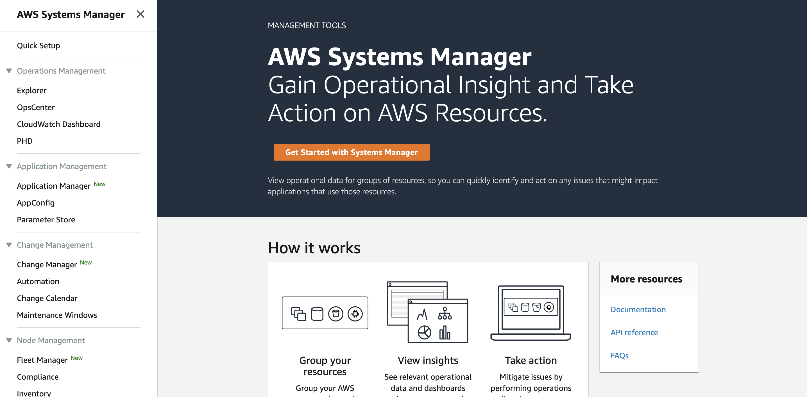

3. Click on Create Parameter

   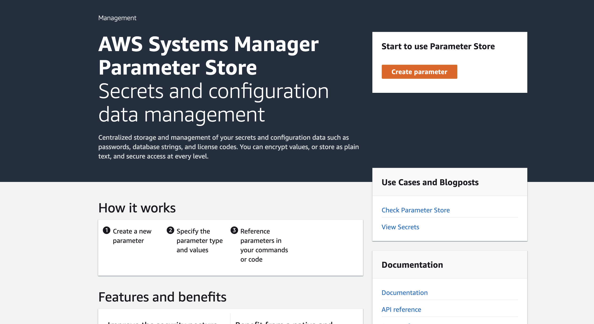

4. Provide Parameter details like
    - Name
    - Description
    - Tier
    - Type
    - KMS Key Source & ID
    - Parameter Value
    - Tags
     
    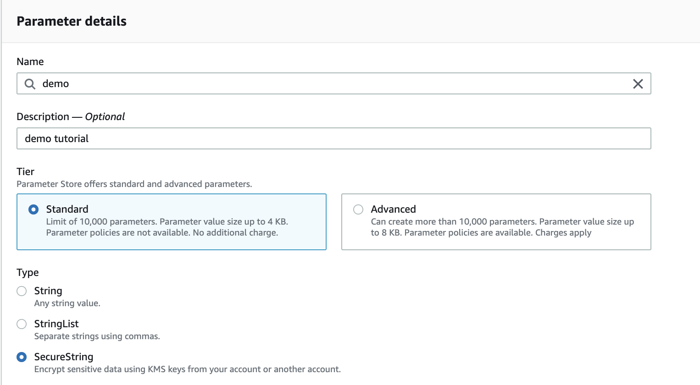
    
    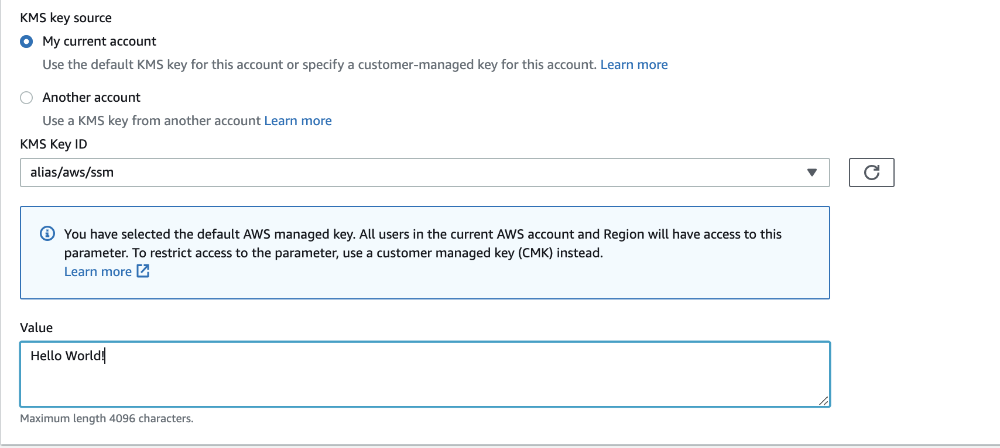
    
    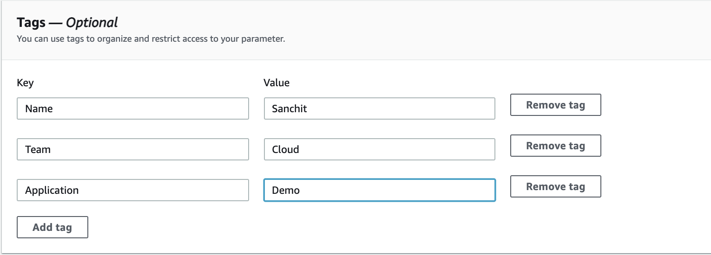

5. After filling in the required details, Select Create Parameter 
 
6. Now you are on the home screen with the list of all Parameter configured in your account, now select your new secret
    
    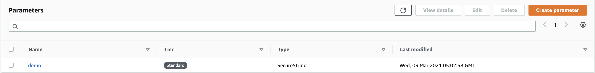
    
7. Select Show to reveal the contents of the secret  

    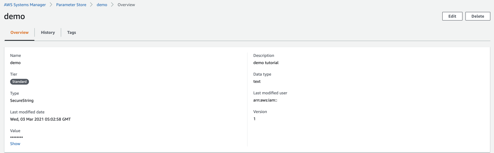

8. History Tab will provide the details around who created, updated, or deleted the secret

    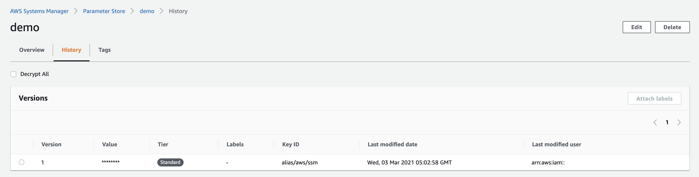
    
    **Note:** Versioning is preserved until you delete the parameter, if you delete the parameter then the history is deleted as well

**Tutorial via AWS CLI**

In this section, we will create a Secure String parameter and retrieve it using the CLI

1. Install AWS CLI - https://docs.aws.amazon.com/cli/latest/userguide/install-cliv2.html

2. After installation run aws configure and set the Access & Secret keys. Set region to us-east-1

    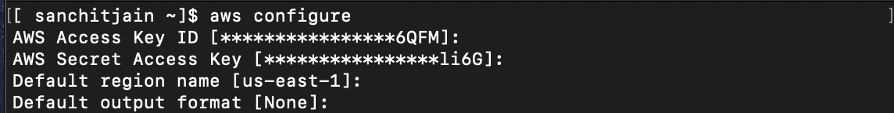
    
    **Note:** for a live setup, it is recommended to use the IAM role for working with AWS Parameter Store

3. Let's retrieve the secret we created in the previous section
    
       Command: aws ssm get-parameter --name “YOURNAME-secret1”

   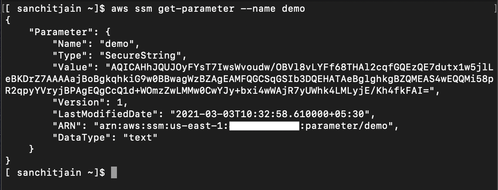

4. We can also retrieve the value as plain text by providing --with-decryption

       Command: aws ssm get-parameter --name “YOURNAME-secret1” --with-decryption

   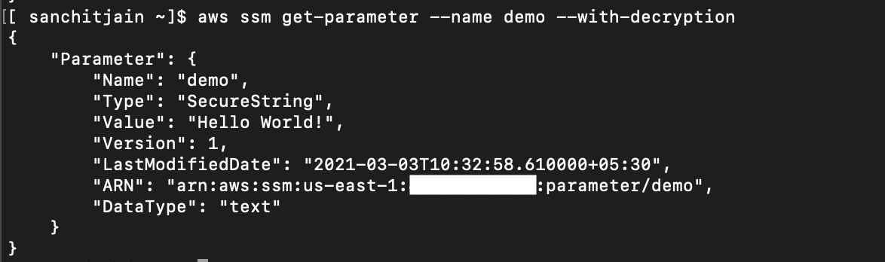
